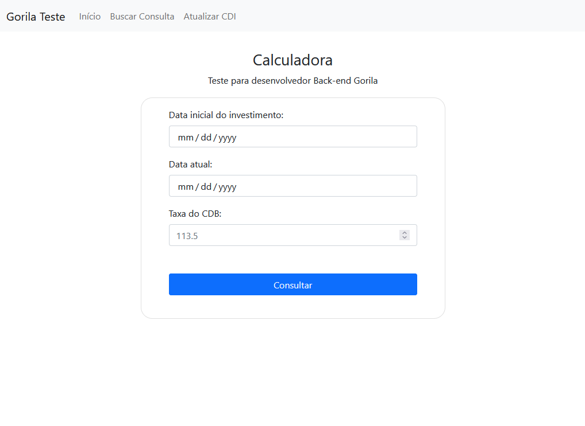
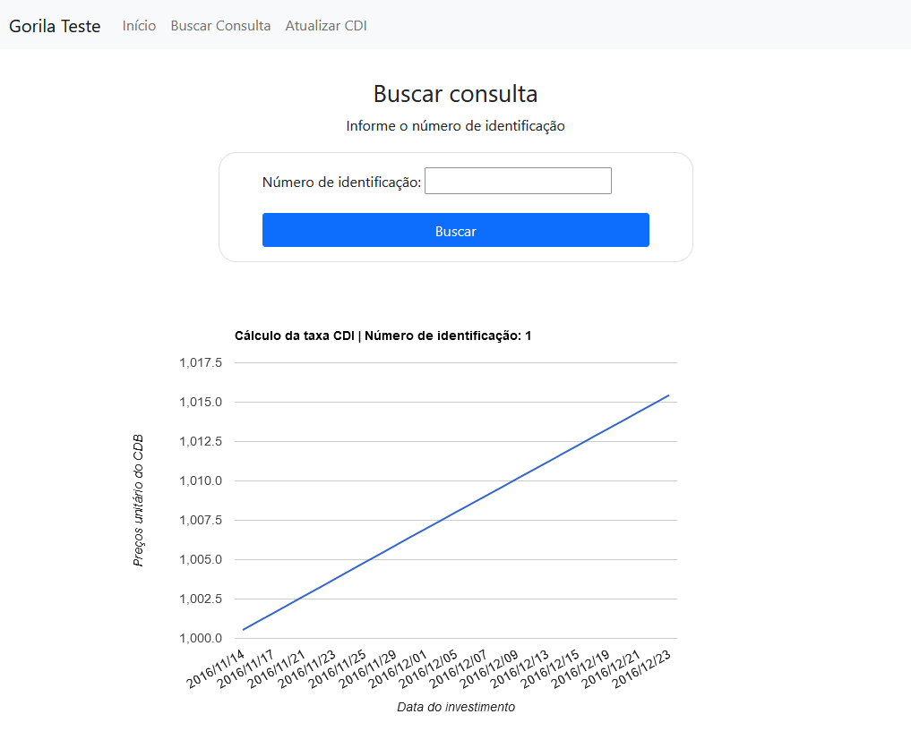

#  Gorila (Front-end)

Teste para desenvolvedor Back-end no Gorila 

## Aplicação

A página está disponivel em : [filipfelipe.github.io/gorila_teste_frontend/index.html](https://filipfelipe.github.io/gorila_teste_frontend/index.html)


## Iniciando

Clone o projeto

```bash
  git clone https://github.com/FilipFelipe/gorila_teste_frontend.git
```

Vá para a pasta do projeto 

```bash
  cd gorila_teste_frontend-main
```


Para iniciar esse projeto, é necessário o [VScode](https://code.visualstudio.com/) com a extensão 
[Live Server](https://marketplace.visualstudio.com/items?itemName=ritwickdey.LiveServer). Na pasta raiz do projeto, é só 
clicar no botão **(Go Live)** e o projeto será aberto no seu navegador.
```bash
  http://localhost:5500
```


## Alteração do link da API
O endereço da API pode ser alterado nos arquivos
- /assets/js/chart.js 
- /assets/js/index.js
- /assets/js/upload.js

```javascript
const Api = 'https://localhost:3000'
```


## Funções 
- Cadastrar nova consulta de resultados 
- Buscar consultas cadastradas e visualizar a evolução do valor calculado
- Atualizar o banco de dados por meio de um arquivo em formato CSV, disponibilizado pelo [Link](https://gorila-blog.s3-us-west-2.amazonaws.com/CDI_Prices.csv)


## Screenshots

> Tela inicial 
<div align="center">

</div>

> Tela de busca e visualização dos dados
<div align="center">

</div>

> Tela de atualização
<div align="center">

</div>


## Autor

- [@FilipFelipe](https://www.github.com/filipfelipe)

